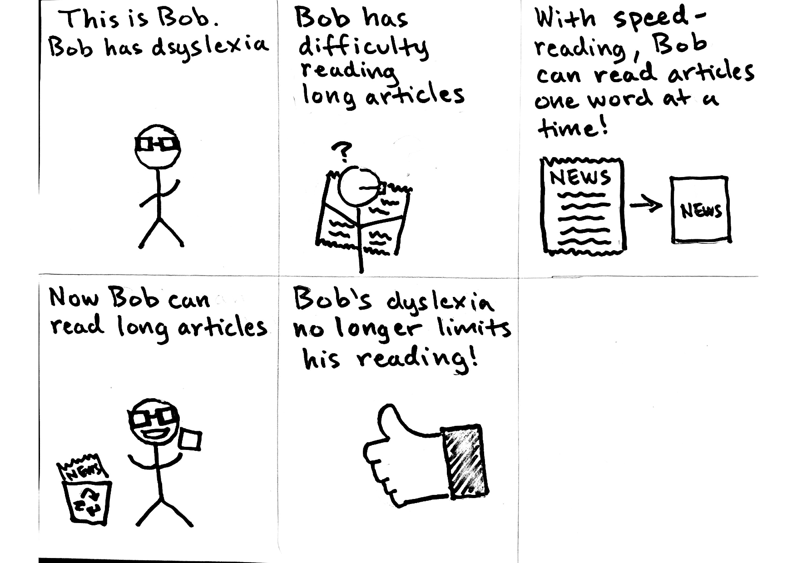

# Visionaries

### Alex Ng | Cruz Rico | Jiajun (Jim) Chen | Shane Gilbert

#### Pitch

Important news articles made readable for all, whether you are on a time crunch or have difficulty focusing on long blocks of text in general, this app is for you! Reading has never been more convenient.

#### Proposal

The main target users of this app are people with mild to moderate dyslexia. Dyslexia affects one's ability to read efficiently: our app makes use of speed-reading to help those with dyslexia. We also aim to make our app general purpose so that any person can read and improve their reading efficiency. Our current plan is to use Google's News API to gather news articles and a speed reader API to generate speed reading formatted articles for our users. We may also include user login with Google/Facebook APIs so that they may save favorite articles and keep track of their reading history.

[What is speed-reading?](http://www.zapreader.com/)

#### Storyboard 1
|  |
|:--:|
| *This storyboard illustrates a person with dyslexia trying to read the news* |

#### Storyboard 2
**Description**
*This storyboard shows a student who forgot to read an article for class, but is able to quickly read it using the app.*
 

#### The following Paper Prototypes corresponded to our original idea - an OCR scanner that reads physical data sheets and parses the data into an app. This idea was originally aimed for optometrists to inventory their incoming orders.  

### Paper Prototype 1

**Overview**  
*Shows the overview of all major screens. The user photographs a physical spreadsheet and the app will scrape its data and inventory the content.*  
  

**Main**  
*Contains the 3 buttons that link to the following pages: New, Inventory, and Visualization.*  
  

**New**  
*The photo ccapturing screen which is used to photograph data sheets that are to be added.*  
  

**Inventory**  
*Allows the user to browse through the previously added datasets and to add/remove datasets.
Could also be modified to allow the user to browse their entire inventory that had been added from the photographed datasets.*  
  

**Visualization**  
*Allows the user to visualize their inventory in the form of graphs to quickly browse what they have in stock.*  
  

### Paper Prototype 2

**OVERVIEW**
*All the main screens layed out. OCR API will read invoice, translate into CSV, where user can then manage inventory digitally.*
 

**Home Screen**
*Sliding gallery for users to manage their current and past inventories. Includes navigation to Camera to add new photos, as well as methods to remove and access to settings.*
 

**Camera**
*Screen that takes pictures to feed into OCR*
 

**Login**
*Login screen for users.*
 

**Inventory**
*Page that allows users to utilized the newly OCR'd inventory sheets to track and match packages.*
 

